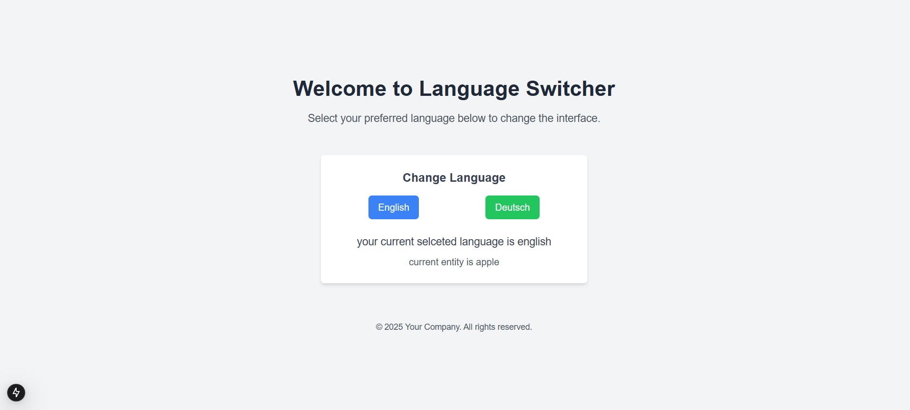

# Sample Project for Internationalization on Next.js

This project demonstrates how to implement internationalization (i18n) in a Next.js application.

## Features

- **Internationalization** using `next-intl`
- **Modern styling** with `tailwindcss`
- **Type safety** with `Typescript`

## Packages Used

- [Next.js](https://nextjs.org/)
- [Tailwind CSS](https://tailwindcss.com/)
- [Typescript](https://www.typescriptlang.org/)
- [Next Intl](https://next-intl.dev/docs/getting-started/app-router/without-i18n-routing)
 

